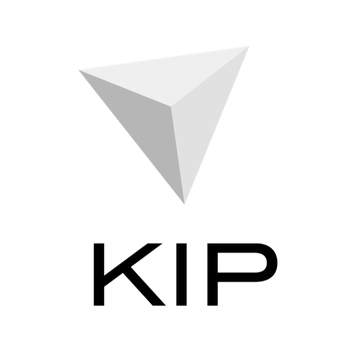

# KIP Project outline

<h1 align="center">
    
</h1>

**TABLE OF CONTENTS**
- [KIP Project outline](#kip-project-outline)
    - [Overview](#overview)
    - [Project Organization](#project-organization)
    - [Documentation](#documentation)
    - [Project Discussion](#project-discussion)
    - [Tools](#tools)
    - [Dev Communication Channels](#dev-communication-channels)
    - [Meetups on KIP](#meetups-on-kip)
    - [KIP related Talks & Papers](#kip-related-talks-papers)
    - [Join KIP](#join-kip)
    - [Contribute to KIP](#contribute-to-kip)
    - [LICENSE](#license)

## Overview

KIP is a distributed intelligence protocol that creates hybrid cooperative digital mesh by integrating a new business-ready Gen3 blockchain technology, heterogeneous distributed data, trustable cognition and connected devices.

Our mission is to bring together Intelligence, Connectedness and Trust (the new ICT!) to create a fundamental digital fabric on which new digital services can be directly built using distributed intelligence.

## Project Organization

* [go-kip](https://github.com/KIPFoundation/go-kip/) is the reference implementation of KIP in Go language
* [js-kip](https://github.com/KIPFoundation/js-kip/) is a JS implementation of KIP

## Documentation

* [wiki](https://github.com/KIPFoundation/wiki/) - All KIP related documentation such as Whitepapers, Tech Primer, Formal specifications etc.
* [pm](https://github.com/KIPFoundation/pm/)  - KIP Project Management related documentation including meeting agenda, meeting notes, sprint & retrospectives notes, voting results for breaking changes.

## Project Discussion

* KIP Discourse TBA soon

## Tools

* TBA

## Dev Communication Channels

* RFCs for architectural & design patterns - https://github.com/KIPFoundation/rfcs/issues/
* `go-kip` developers & maintainers communicate on the Gitter channel - https://gitter.im/kipfoundation/go-kip-dev
* `kide` developers & maintainers communicate on the Gitter channel - https://gitter.im/kipfoundation/kide-dev
* `TDU` developers & maintainers communicate on the Gitter channel - https://gitter.im/kipfoundation/tdu-dev
* Core developers & maintainers communicate on the Gitter channel - https://gitter.im/kipfoundation/core-dev/ (Invitation Only)
* diApp developers willing to use KIP may use the slack channel #diapps - https://kipfoundation.slack.com/

## Meetups on KIP

* TBA

## KIP related Talks & Papers

Event | Date | Title | Video | Doc
------|-------|-------|-----|-----
 Technical Seminar on TARA | 19 May 2017 | Ternary Augmented Raft Architecture (TARA): A Consensus method and model for Fail-Safe computational validation | NA | NA
 Let's Talk Blockchain | 1 March 2018 | KIP & TDU | NA | NA
 50p | 28 March 2018 | TDU – A new measure of value in digital ecosystems | NA | NA
 Indo-American Chamber of Commerce | 4 April 2018 | Blockchain & its transformational potential | NA | NA

## Join KIP

KIP Foundation is the destination for budding & seasoned talents with a strong grasp on computational theories, economics, & code. 

Explore full-time opportunities for working along with us [here](http://kip.foundation/join/).

## Contribute to KIP

KIP is built on several open-source projects and we are always open to enhancements!

You will be required to sign the [Contributor License Agreement (CLA)](/CLA.md) before we are able to merge. If you have any questions about the contribution process, please feel free to send an email to [dev@kip.foundation](mailto:dev@kip.foundation).  

Once done, please go through our [CONTRIBUTING GUIDELINES](/CONTRIBUTING.md) and feel free to file issues, bugs & PRs.  

## LICENSE

https://github.com/KIPFoundation/kip

Copyright (c) 2018 [KIP Foundation](http://kip.foundation)  
Except as noted in [USAGE](/USAGE.md), content licensed under [CC-BY-SA-4.0](/LICENSE).

Unless required by applicable law or agreed to in writing, software distributed under the License is distributed on an "AS IS" BASIS, WITHOUT WARRANTIES OR CONDITIONS OF ANY KIND, either express or implied. See the License for the specific language governing permissions and limitations under the License.